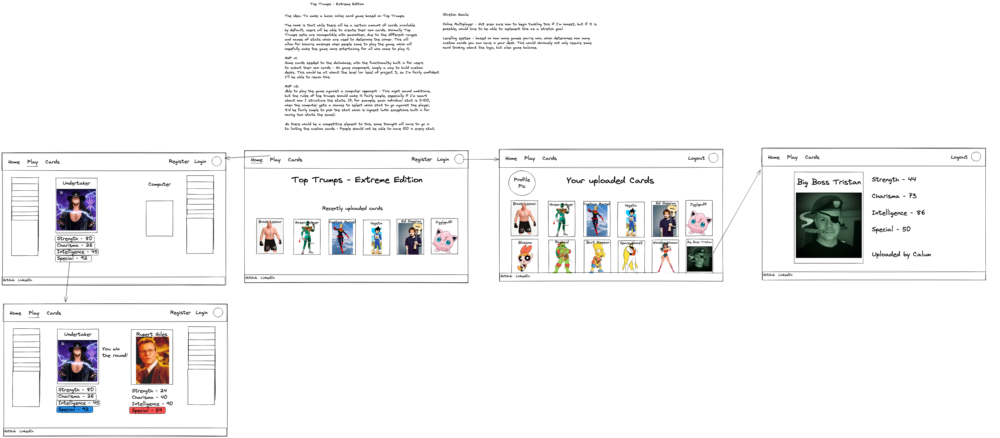
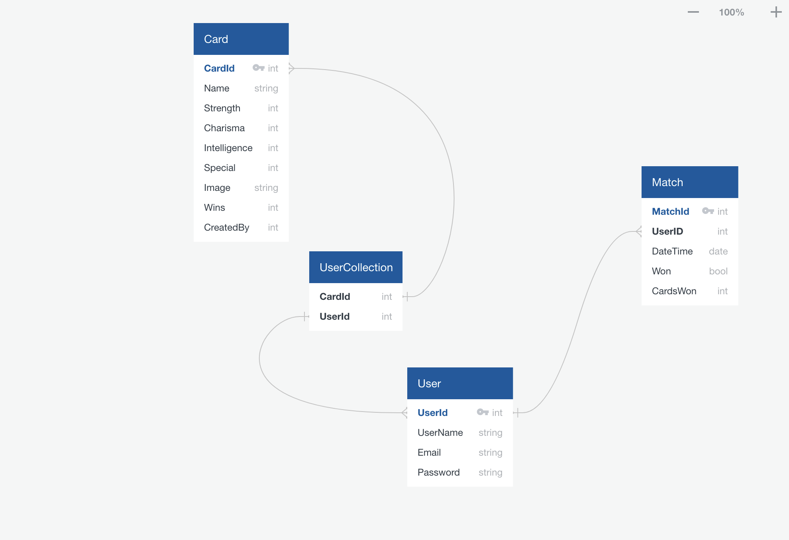
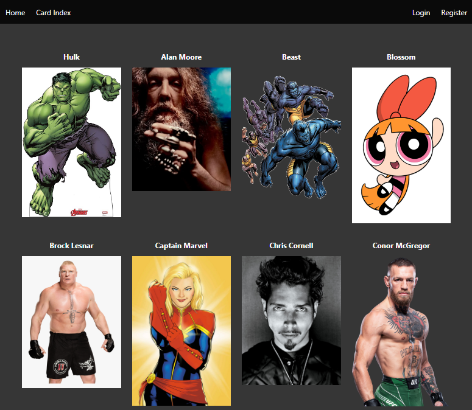
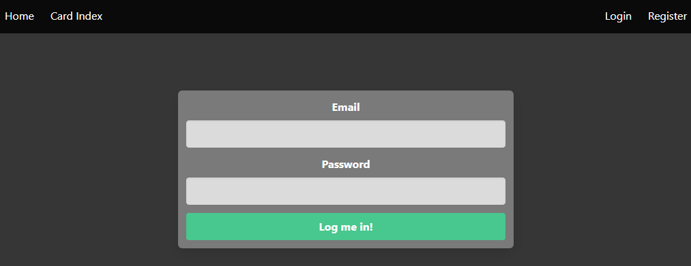
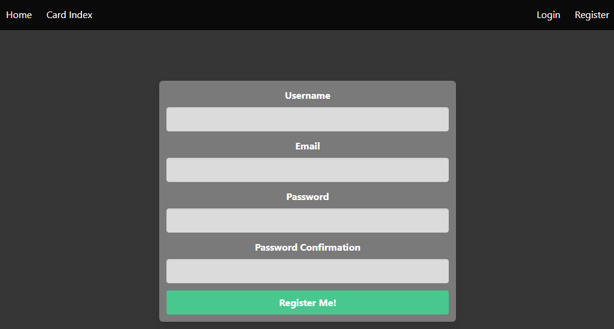
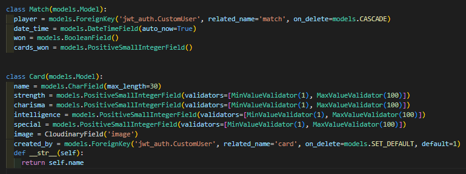
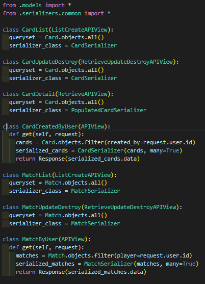
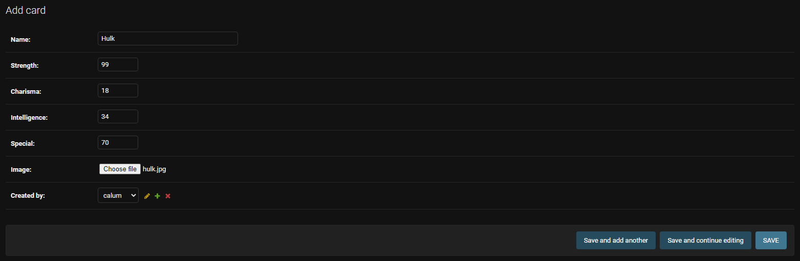
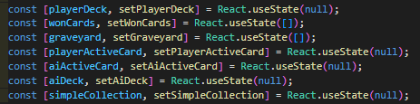
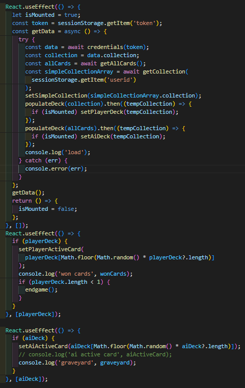

# Project 4 - 'Top Trumps: Extreme Edition'

Top Trumps: Extreme Edition is a full stack app, utilising Django & PostgreSQL for the backend, and React.js for the frontend. The concept for the app was to create a playable version of Top Trumps that could support players uploading their own cards, and build their collection by playing games against the computer. This as my fourth project for General Assembly's Software Engineering Immersive course. I worked on this project on my own.

**Duration** - 7 days

**Link** (Project not yet deployed)

## Technologies Used

**Front End** - HTML, CSS, JavaScript, React.js, Bulma, SASS, Cloudinary

**Back End** - Python, Django, PostgreSQL, JSON Web Token (JWT), Cloudinary

**Development** - Excalidraw, Git, Github, Postman, NPM, Netlify, Heroku,

## The Brief

- Build a full-stack application by making your own backend and your own front-end.
- Use a Python Django API using Django REST Framework to serve your data from a Postgres database.
- Consume your API with a separate front-end built with React.
- Be a complete product which most likely means multiple relationships and CRUD functionality for at least a couple of models.

## Development Process

After deciding upon the concept, I started by planning out the app in Excalidraw.

I also created an Entity Relationship Diagram (ERD) using QuickDBD.

## App Overview

### Card Index

## Technical Overview

### Backend

The first few days of development were spent on building the backend with Django. It was interesting comparing the differences between building an API from scratch with Django and MERN.

I integrated Cloudinary into the backend of the app, which allowed me to easily upload images on the backend while seeding the database.

### Frontend

Once I was finished building the Backend, I started work on the frontend. The component that required the most work was the Top Trumps game page. First, I set up multiple pieces of State, for all of the moving parts in the game.

Most of these are set within `useEffect` functions.

I set up a function to read which stat the player chooses, which then determines whether or not the player wins the round.

## Design Notes

Bulma was used as the base of the styling, with some CSS and SCSS written on top to customise the style to my needs. The styling is fairly minimal, do ensure it does not clash with any of the user uploaded cards.

## Known bugs, other issues and scope for improvement.

Unfortunately, I ran into multiple technical problems at the beginning of this project, that hindered my ability to build the backend. These issues seemed to center around an odd compatibility issue with PostgreSQL on M1 Macbook Pros. While I was able to eventually overcome these issues, this meant that I was unable to finish this project to my satisfaction in time for the deadline.

One of the other key challenges I faced was dealing with so many different pieces of state in the Top Trumps game. This was similar to the issues I dealt with while working on the Valorant Guessing Game project, though on a much larger scale. Thankfully, I was able to use that experience to help me through these.

## Wins and Key Learnings

While I learned a lot on the technical side (most obviously with Django & Python, as this was my first experience with those technologies), the most important thing I learned was to ensure I do a better job of managing my time on solo projects. While I'm pleased I was able to create a functioning game, I wasn't able to implement all the features and styling I would have liked in a full polished release. I think this was mainly due to me taking on a project that had a greater scope than previous group projects, combined with the technical issues I ran into that slowed the project's development. When I have free time over the next couple of weeks, I hope to polish this project up to a higher standard.

On the technical side, I found the experience of learning and using Django to be extremely rewarding. Building an API with Django is very different structurally from building one with MERN, but I really came to appreciate the advantages and disadvantages of both approaches.
